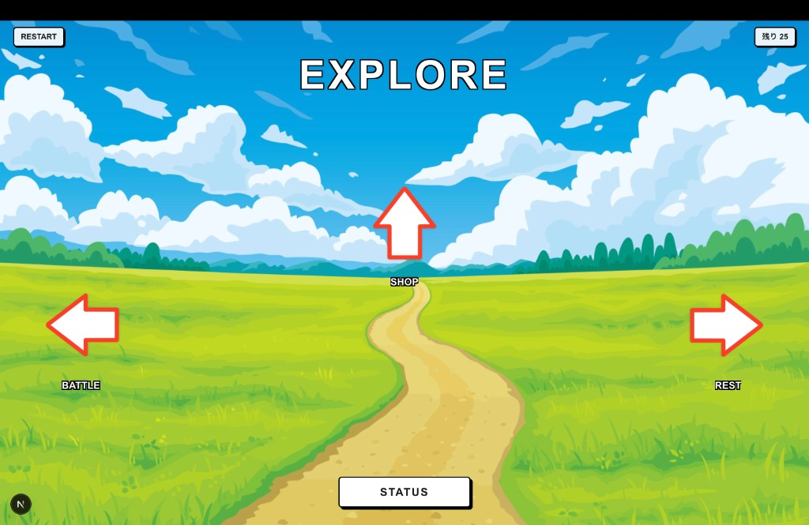
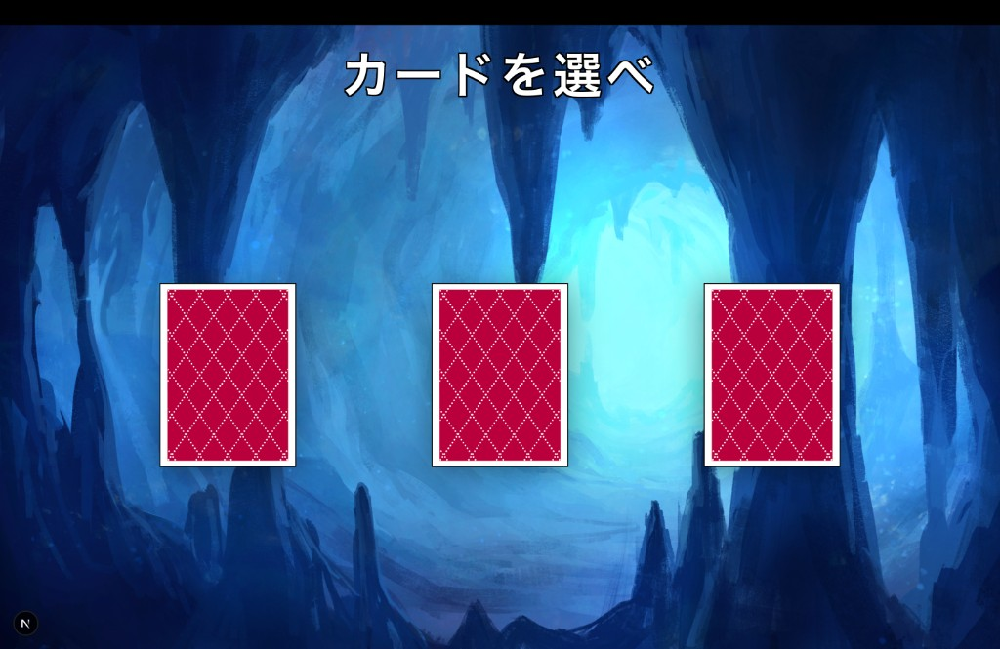
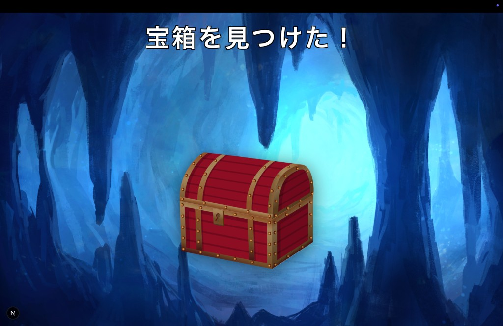

# Explore Mass Game

> **Status:** 開発中（WIP） — ゲームロジックと主要画面は動作。UI レイアウトを順次整備中

限られた「マス（25 手）」の中で探索・戦闘・強化を行い、最終スコアで競い合う Web ゲームです。  
Java（Spring Boot）でゲームロジックと API を構築し、Next.js で操作 UI を提供するフルスタック構成です。

**Author:** [Yuki Miyamoto (TKtkGg)](https://github.com/TKtkGg)

---

## Screenshots

| 探索画面 | カード選択 | 宝箱イベント |
|:---:|:---:|:---:|
|  |  |  |

- **探索画面** — 残りマス数を表示し、3 方向のルート（戦闘 / ショップ / 休憩など）から進行先を選択
- **カード選択** — 未所持カードが残っている場合に出現。永続的な強化要素として獲得
- **宝箱イベント** — ステータス強化または装備入手の分岐

---

## プロジェクト概要

### ゲームコンセプト

1 ランあたり **25 マス** の制限の中で、ランダムに提示されるルートを選びながら進むローグライク風ゲームです。

| ルート | 内容 |
|--------|------|
| BATTLE | 敵とターン制戦闘。経験値・ゴールドを獲得 |
| SHOP | 回復アイテムやカードを購入 |
| REST | HP を回復して次のマスへ |
| TREASURE | ステータス強化 or 装備宝箱 |
| CARD | 未所持カードから 1 枚を選択して獲得 |

マスが尽きるとゲームオーバー。最終スコアを PostgreSQL に保存し、ランキングで競い合います。

### 作成背景

コンソール版 Java ゲームの知見を活かしつつ、**学習中の Java を実際のアプリケーションとして形にする**ことを目的に開発を開始しました。  
単なる CLI 演習ではなく、REST API 設計・状態管理・DB 連携まで含めた Web アプリとして設計しています。

---

## 技術スタック

| 領域 | 技術 |
|------|------|
| Frontend | TypeScript, Next.js 16 (App Router), Tailwind CSS 4 |
| Backend | Java 21, Spring Boot 4 |
| Database | PostgreSQL 16 (Docker) |
| インフラ | Docker Compose（DB のみ） |

### 技術選定理由

| 技術 | 選定理由 |
|------|----------|
| **Java / Spring Boot** | 学習中の Java を、Controller → Service → Repository の実務的なレイヤ構成で使い、オブジェクト指向設計と DI を実践するため |
| **TypeScript / Next.js** | 現行のフロントエンド主力スタック。App Router による画面分割と API 連携を標準的な構成で実装するため |
| **PostgreSQL** | Java エコシステムとの相性が良く、JPA/Hibernate による永続化を学ぶうえで一般的な選択肢のため |

---

## アーキテクチャと設計方針

### 全体構成

```
Browser (Next.js)
    │  fetch (apiClient.ts)
    ▼
Spring Boot REST API
    ├── Controller   … HTTP エンドポイント / CORS
    ├── Service      … ユースケース単位のビジネスロジック
    ├── gamestate/   … セッション内ゲーム状態（Spring Bean）
    ├── domain/      … ルート種別・戦闘選択などの値オブジェクト
    ├── dto/         … リクエスト / レスポンスの型定義
    ├── entity/      … JPA エンティティ（スコア永続化）
    └── repository/  … DB アクセス
         │
         ▼
    PostgreSQL（スコアランキング）
```

### バックエンドの設計判断

**1. ゲームドメインと Spring 層の分離**

`character/`, `card/`, `battle/`, `treasure/` など、コンソール版から継承したドメインロジックを Spring パッケージ外に配置しています。  
Service 層がこれらを組み合わせることで、**フレームワーク非依存のゲームルール**と **Web 向けの状態管理**を役割分担しています。

**2. `gamestate/` によるセッション状態管理**

プレイヤー HP、残りマス数、所持カード、戦闘中フラグなどを `@Service` Bean として保持。  
各 API 呼び出しが同一 Bean を参照することで、ステートレスな HTTP 上にゲームセッションを構築しています。

**3. DTO による API 契約の明示**

`MoveRequest` / `MoveResponse` など、画面ごとに入出力型を定義。  
フロントエンドは `apiClient.ts` 経由で型付き通信を行い、エラーは `GlobalExceptionHandler` で統一レスポンスに変換します。

### フロントエンドの設計判断

**1. App Router による画面単位の分割**

`src/app/` 配下にゲームフェーズごとの `page.tsx` を配置（explore, battle, shop, treasure, card, status, gameover, ranking など）。

**2. Atomic Design によるコンポーネント整理**

| レイヤ | 例 |
|--------|-----|
| atoms | `MainButton`, `Title`, `ErrorAlert` |
| molecules | `RouteAllowButton`, `CardButton`, `TreasureButton` |

画面ロジック（API 呼び出し・状態遷移）は `page.tsx` に集約し、UI 部品は再利用可能なコンポーネントとして切り出しています。

### 開発分担

| 担当 | 範囲 |
|------|------|
| **本人** | バックエンド全般、フロントエンドの機能実装（API 連携・画面遷移・状態管理） |
| **AI（Cursor）** | フロントエンドのレイアウト実装（Tailwind による UI 再現） |

ゲームルールと API 設計は本人が主導し、UI の見た目部分は AI を補助ツールとして活用しています。

---

## 開発状況

### 実装済み

- [x] ゲームコアロジック（探索・戦闘・ショップ・休憩・宝箱・カード）
- [x] REST API 全エンドポイント（10 Controller）
- [x] セッション状態管理（`gamestate/` 配下）
- [x] スコア永続化とランキング（PostgreSQL + JPA）
- [x] フロントエンド主要画面と API 連携
- [x] 探索・カード選択・宝箱画面のレイアウト

### 開発中

- [ ] 戦闘・ショップ・ステータス・装備・ゲームオーバー・ランキング画面のレイアウト整備

### 今後の予定

- [ ] 全画面の UI を統一したビジュアルに仕上げる
- [ ] ゲーム体験を深める新要素の追加（イベントバリエーション、バランス調整など）

---

## 工夫した点

### 実務を意識したファイル構成

- **Controller / Service / Repository** の 3 層を Spring Boot の慣例に沿って配置
- **ドメインロジック**（`character/`, `card/` 等）をフレームワーク層から分離し、責務を明確化
- **DTO** で API の入出力を型として固定し、フロントとの契約を可視化

### ゲームルールの条件分岐を Service 層に集約

例：`MoveService` では未所持カードがなくなった場合、ルート候補から CARD を除外する処理をバックエンド側で行い、フロントはレスポンスを表示するだけにしています。  
**ルールはサーバー側が唯一の真実（Single Source of Truth）** という方針です。

### フロントエンドの関心分離

- `lib/apiClient.ts` — HTTP 通信とエラーハンドリングを集約
- `type/types.ts` — レスポンス型の定義
- `page.tsx` — 画面ごとの状態管理とルーティング

---

## ディレクトリ構成

```
explore-mass-game/
├── backend/                          # Spring Boot API
│   └── src/main/java/
│       ├── battle/                   # 戦闘ドメインロジック
│       ├── card/                     # カード定義・効果
│       ├── character/                # キャラクター・敵
│       ├── equipment/                # 装備
│       ├── explore/                  # 移動ロジック
│       ├── item/                     # アイテム
│       ├── shop/                     # ショップ
│       ├── treasure/                 # 宝箱
│       └── com/example/backend/
│           ├── controller/           # REST エンドポイント
│           ├── service/              # ユースケース
│           │   └── gamestate/        # セッション状態 Bean
│           ├── domain/               # 値オブジェクト
│           ├── dto/                  # リクエスト / レスポンス
│           ├── entity/               # JPA エンティティ
│           ├── repository/           # DB リポジトリ
│           └── exception/            # 例外ハンドリング
├── frontend/                         # Next.js UI
│   └── src/
│       ├── app/                      # 画面（App Router）
│       ├── components/
│       │   ├── atoms/                # 最小 UI 部品
│       │   └── molecules/            # 複合 UI 部品
│       ├── lib/                      # API クライアント
│       └── type/                     # 型定義
├── docs/screenshots/                 # README 用スクリーンショット
└── docker-compose.yml                # PostgreSQL 起動
```

---

## API エンドポイント（概要）

| Method | Path | 用途 |
|--------|------|------|
| POST | `/start` | ゲーム開始 |
| GET | `/move/status` | 現在の探索状態取得 |
| POST | `/move` | ルート選択・移動 |
| POST | `/move/rest` | 休憩（HP 回復） |
| GET/POST | `/battle/*` | 戦闘開始・行動 |
| GET/POST | `/shop/*` | ショップ |
| GET/POST | `/treasure/*` | 宝箱 |
| GET/POST | `/card/*` | カード選択 |
| GET | `/status` | プレイヤーステータス |
| GET/POST | `/equipment/*` | 装備 |
| POST | `/gameover` | ゲーム終了・スコア保存 |
| GET | `/ranking` | ランキング取得 |

---

## セットアップ

### 前提

- Java 21+
- Node.js 20+
- Docker / Docker Compose

### 1. データベース起動

```bash
docker compose up -d
```

PostgreSQL が `localhost:5433` で起動します。

### 2. バックエンド起動

```bash
cd backend
./mvnw spring-boot:run
```

API は `http://localhost:8080` で待ち受けます。

### 3. フロントエンド起動

```bash
cd frontend
npm install
```

`frontend/.env.local` を作成:

```env
NEXT_PUBLIC_API_URL=http://localhost:8080
```

```bash
npm run dev -- -p 3001
```

ブラウザで `http://localhost:3001` を開きます（バックエンドの CORS 設定が `localhost:3001` を許可）。

---

## ロードマップ

1. **全画面のレイアウト完成** — 戦闘・ショップ・ステータス等の UI を探索画面と同等の品質に統一
2. **ゲーム体験の拡張** — イベントバリエーション追加、難易度・スコア計算の調整、リプレイ性の向上

---

## ライセンス

[MIT License](./LICENSE)

---

## 関連リンク

- GitHub: [https://github.com/TKtkGg](https://github.com/TKtkGg)
- リポジトリ: [https://github.com/TKtkGg/explore-mass-game](https://github.com/TKtkGg/explore-mass-game)
